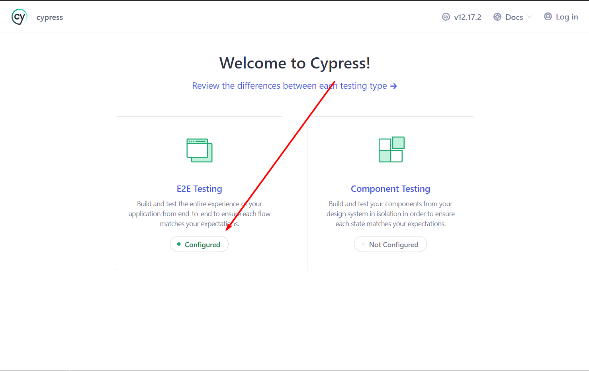
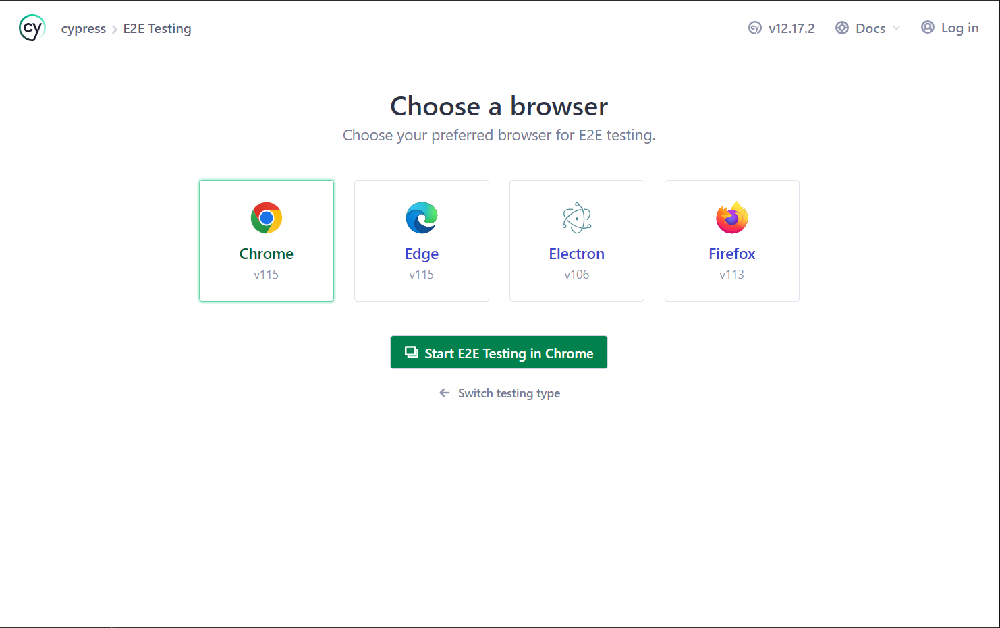
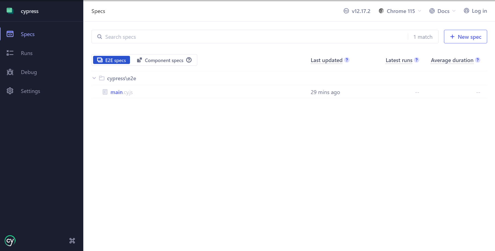

## Setup

### Step 1 - Dependencies

You will need:

* [Git](http://git-scm.com/downloads)
* [node.js](https://nodejs.org/) (>= 10.x)

Please install them if you don't have them already.

### Step 2 - Clone the repository:

From the command line, clone the repository using the url: https://github.com/Vitaliy-Sotnyk/cypressTest.git.

### Step 3 - Install dependencies

```sh
$ cd PROJECT_DIRECTORY
$ npm install
```
This will install all the dependencies for all the tasks, _it might take a while_.

### Step 3 - Run cypress

```sh
$ npm run cy_open
```
- Run this command and wait until the next image wouldn't open:
  
  When this window would be opened, press on the "E2E Testing" box.

- After that, you should see the window where you could choose one of the browsers which will be created a test simulation.
  
  As for me, I always use Chrome)

- When the browser will be opened you could see the next window: 
  
  Here you need just press on the main.cy.js and wait. The test will be run automatically.
